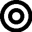

#  Augmentor

[](https://hub.docker.com/r/gendalf90/augmentor)

## What is it?

The augmentor is a proxy server that catches requests to an OpenAI api and enriches it with connected MCP servers implicitly. The proxy also intercepts responses from Model and calls available MCP with sending back results to Model. It also can be pipelined into implicit chain beetwen client and Model providing a lot of tools for the Model without client modification.

## How it works?

To run Augmentor you can use docker image:

```bash
docker run -d \
  --name augmentor \
  -e OpenAIUrl='http://1.2.3.4:1234/' \ # by default http://localhost:11434/ (with --network=host for example)
  -e Mcp__Server1__Endpoint='http://1.2.3.4:8811/sse' \ # the settings format is Mcp__{any unique name or key}__{parameter name}
  -p 8080:8080 \
  --restart=unless-stopped \
  gendalf90/augmentor:latest
```

The complex example for using several mcp tools with authorization and tools filtering:

```bash
docker run -d \
  --name augmentor \
  -e OpenAIUrl='http://1.2.3.4:1234/' \
  -e Mcp__Server1__Endpoint='http://1.2.3.4:8811/sse' \
  -e Mcp__Server1__BearerToken='token' \
  -e Mcp__Server1__Include='fetch_html,fetch_txt' \ # to use only these mcp tools from server
  -e Mcp__Server2__Endpoint='http://1.2.3.4:8822/sse' \
  -e Mcp__Server2__Exclude='write_file,edit_file' \
  -e Mcp__Server2__OAuth__TokenEndpoint='https://1.2.3.4/oauth/token' \
  -e Mcp__Server2__OAuth__ClientId='user' \
  -e Mcp__Server2__OAuth__ClientSecret='secret' \
  -e Mcp__Server2__OAuth__Scope='some' \
  -p 8080:8080 \
  --restart=unless-stopped \
  gendalf90/augmentor:latest
```

Then just send a question for model through the proxy (only *responses* api is supported):

```bash
curl "http://localhost:8080/v1/responses" -d '{ "model": "huggingface.co/unsloth/qwen3-8b-gguf:UD-Q4_K_XL", "input": "Describe the content of the page: https://en.wikipedia.org/wiki/Artificial_intelligence" }'
```
